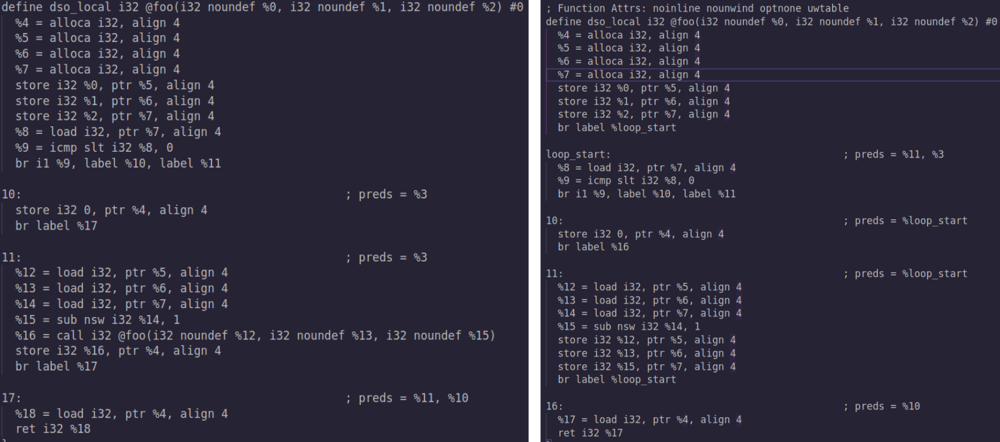
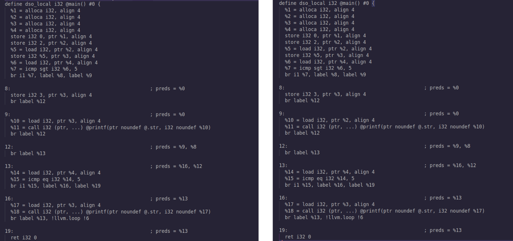

# Compiler Construction Project

## Overview
Project for the *Compiler Construction* course focused on implementing two LLVM optimizations:
- **Tail Call Elimination**
- **Copy Propagation**

## Tail Call Elimination
Optimizes recursive calls by converting tail recursion into jumps, avoiding extra stack frames.

**Steps:**
1. Detect tail-recursive calls (`return` or unconditional branch after call).  
2. Create a loop entry block and map parameters to memory.  
3. Replace recursive calls with a branch to the new block.

## Copy Propagation
Replaces redundant variable copies with direct references.

**Steps:**
1. Map variables to memory locations.  
2. Compute `CPIn` / `CPOut` sets for each block.  
3. Replace loads with available copies where possible.

## References
1. *Advanced Compiler Design and Implementation* – S. Muchnick  
2. Harvard CS153 Lecture Notes  
3. GeeksforGeeks – Compiler Optimizations  
